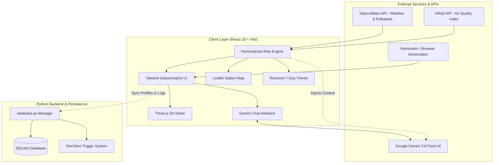

# 🌍 Vayu Rakshak (वायु रक्षक)
### *AI-Powered Personalized Environmental Health & Air Quality Intelligence Platform*

[](https://reactjs.org/)
[](https://vitejs.dev/)
[](https://tailwindcss.com/)
[](https://threejs.org/)
[](https://ai.google.dev/)
[](https://www.sqlite.org/)
[](https://github.com/)

---

## 📌 Overview

**Vayu Rakshak** (*Air Guardian*) is a next-generation, hyper-personalized environmental health intelligence platform. While traditional air quality monitoring services broadcast **generic, one-size-fits-all warnings** (e.g., *"AQI is 180: Avoid outdoor activities"*), Vayu Rakshak understands that clean air and pollution impact every individual differently.

By synthesizing real-time environmental metrics (PM2.5, PM10, NO₂, SO₂, CO, Ozone, UV Index, Heat Index) with an individual's **age profile**, **respiratory and cardiovascular vulnerabilities**, and **occupational exposure**, Vayu Rakshak calculates a dynamic **Personalized Risk Index (0–100)** and delivers explainable, actionable medical and lifestyle advisories powered by **Google Gemini AI**.

---

## 👥 Team Cypher — Problem Statement 4

> **Category**: AI + Development  
> **Problem Statement**: PS-4: AI-Powered Personalized Weather & AQI Health Advisory System

| Team Member | Roll / ID | Core Responsibility |
| :--- | :--- | :--- |
| **Shubham Kumar Singh** | `25BAI11373` | Full Stack Developer & System Architect |
| **Sanju Kumar** | `25BAI10918` | Backend & AI Services Developer |
| **Ayush Gautam** | `25BAI10568` | Frontend Developer & UI/UX Specialist |
| **Gaurang Shukla** | `25MEI10068` | Data & Environmental Research Lead |

---

## 🎯 The Core Problem & Gap Analysis

```
┌──────────────────────────────────────────────────────────┐
│              TRADITIONAL AIR QUALITY APPS                │
├──────────────────────────────────────────────────────────┤
│ ❌ Static thresholds for the entire population           │
│ ❌ Ignores age (infants, elderly vs healthy adults)       │
│ ❌ Ignores chronic diseases (Asthma, COPD, Cardiac)      │
│ ❌ Ignores daily occupations (Office worker vs Courier)  │
│ ❌ Vague, generic warnings ("Stay indoors")              │
└────────────────────────────┬─────────────────────────────┘
                             │
                             ▼
┌──────────────────────────────────────────────────────────┐
│               THE VAYU RAKSHAK PARADIGM                  │
├──────────────────────────────────────────────────────────┤
│ ✅ Multi-factor personalized risk modeling (0-100)       │
│ ✅ Explainable AI: "Why This Alert?" causal diagnostics   │
│ ✅ Tailored protection: masks, exercise timing, medicine │
│ ✅ Interactive 3D WebGL Earth & GIS Station Heatmaps     │
│ ✅ Gemini AI contextual health chatbot                   │
│ ✅ SQLite persistence for audit logs & Red Alerts        │
└──────────────────────────────────────────────────────────┘
```

---

## 🔬 Personalized Risk Calculation Engine

Vayu Rakshak replaces basic AQI color bands with an algorithmic multi-factor vulnerability equation:

$$\text{Personal Risk Score} = \text{Base AQI} + \Delta\text{UV} + \Delta\text{Temp} + \Delta\text{Age} + \Delta\text{Condition} + \Delta\text{Occupation}$$

$$\text{Score} = \min\big(100, \max(0, \text{Score})\big)$$

### 1. Environmental Risk Factors
* **Base AQI**:
  * $0 - 50 \implies +10$
  * $51 - 100 \implies +30$
  * $101 - 150 \implies +50$
  * $151 - 200 \implies +70$
  * $201 - 300 \implies +85$
  * $> 300 \implies +100$
* **UV Index Modifier**: $\text{UV} \ge 8 \implies +15$, $\text{UV} \ge 6 \implies +10$, $\text{UV} \ge 3 \implies +5$
* **Temperature Modifier**: $\ge 40^\circ\text{C} \implies +15$, $\ge 35^\circ\text{C} \implies +10$, $\le 5^\circ\text{C} \implies +10$

### 2. User Vulnerability Modifiers
* **Age Profile**:
  * Senior ($60+$): $+20$
  * Child ($<12$): $+15$
  * Teen: $+5$
  * Adult: $+0$
* **Health Conditions**:
  * COPD: $+30$
  * Asthma: $+25$
  * Cardiovascular Illness: $+25$
  * Environmental Allergies: $+15$
  * Other Respiratory Issues: $+10$
* **Occupational Exposure**:
  * Traffic Police / Wardens: $+25$
  * Delivery Executives: $+20$
  * Outdoor Construction / Field Workers: $+20$
  * Students: $+5$
  * Indoor Office Workers: $+0$

### 3. Risk Classifications
| Score Range | Level | Color Code | Action Required |
| :---: | :---: | :---: | :--- |
| **0 – 25** | `LOW` | 🟢 `#22c55e` | Ideal conditions for outdoor activities & exercise. |
| **26 – 50** | `MODERATE` | 🟡 `#eab308` | Sensitive groups should monitor symptoms; normal routine for others. |
| **51 – 75** | `HIGH` | 🟠 `#f97316` | Vulnerable groups must wear N95/FFP2 masks and limit exertion. |
| **76 – 100** | `VERY HIGH` | 🔴 `#ef4444` | **CRITICAL RED ALERT**: Stay indoors, seal rooms, run HEPA purifiers. |

---

## ✨ Key Features

### 1. 🌐 Interactive 3D WebGL Earth
Built using **Three.js** and **React Three Fiber**, the initial viewport immerses users into a photorealistic, rotating 3D Earth with atmospheric glow shaders that pins down their geographic location before smoothly transitioning into the analytics dashboard.

### 2. 📊 Live Multi-Source Environmental Dashboard
* Real-time AQI and detailed pollutant breakdowns: **PM2.5, PM10, O₃, NO₂, SO₂, CO**.
* Live meteorological tracking: **Temperature, Feels Like, Humidity, UV Index, Wind Speed, Precipitation Probability**.
* Dual-source aggregation via **World Air Quality Index (WAQI)** and **Open-Meteo APIs**.

### 3. 🛡️ "Why This Alert?" Diagnostic Breakdown
Eliminates opaque alerts. Transparently lists every contributing factor to the risk score (e.g., *"Asthma increases sensitivity to PM2.5"*, *"High UV index exacerbates ozone irritation"*, *"Traffic exposure increases prolonged toxin inhalation"*).

### 4. 🤖 Google Gemini AI Contextual Health Chatbot
An integrated, empathetic health copilot powered by **Gemini 3.6 Flash**. Unlike generic chatbots, the AI automatically inherits the user's active context:
* Current GPS city & coordinates
* Live AQI & dominant pollutant
* Temperature, humidity, and UV levels
* Personal age, health condition, and daily occupation
* Answers questions on medication precautions, workout timing, mask specifications, and indoor air purification.

### 5. 🗺️ Interactive GIS Station Map
Powered by **Leaflet** and **React Leaflet**, displaying nearby air quality monitoring stations with interactive markers, current station readings, and color-coded risk indicators.

### 6. 🧪 Dynamic Scenario & Demo Simulator
Allows evaluators and users to instantly simulate different scenarios with one click:
* **Asthmatic Senior in High Pollution**
* **Child with Allergies in Spring**
* **Healthy Athlete in Clean Air**
* **Delivery Executive during Severe Smog**

### 7. 🗄️ Relational SQLite3 Backend Engine
The Python SQLite backend (`backend/database.py`) manages structured data persistence:
* `profiles`: User demographic and health settings.
* `aqi_logs`: Time-series logging of AQI and environmental metrics.
* `chat_history`: Conversation logs between users and the Gemini assistant.
* `alerts`: Automated triggers that log critical Red Alerts when `risk_score > 75`.

---

## 🏛️ System Architecture



---

## 🛠️ Technology Stack

| Domain | Technology | Description |
| :--- | :--- | :--- |
| **Frontend Framework** | React 19 + Vite | Modern single-page application with ultra-fast HMR |
| **Styling & Aesthetics** | Tailwind CSS + PostCSS | Dark-mode glassmorphism with custom atmosphere cyan/blue palette |
| **3D Graphics** | Three.js + `@react-three/fiber` + `@react-three/drei` | WebGL hardware-accelerated interactive 3D Earth |
| **Animations** | Framer Motion | Fluid phase transitions, modals, and metric reveals |
| **Geospatial & Maps** | Leaflet + React Leaflet | Interactive nearby station mapping with dynamic tiles |
| **Data Visualization**| Recharts | Responsive 7-day AQI and temperature trend charts |
| **Icons** | Lucide React | High-clarity vector UI iconography |
| **AI / LLM** | Google Gemini API (`gemini-3.6-flash`) | Context-aware personal environmental health counselor |
| **Environmental APIs**| WAQI API + Open-Meteo API | Dual-source real-time meteorological and pollutant telemetry |
| **Geocoding** | OpenStreetMap Nominatim | Reverse geocoding for coordinates to city lookup |
| **Backend & Storage** | Python 3 + SQLite3 | Relational database for profiles, AQI telemetry, and alerts |

---

## 📁 Repository Structure

```
Team cypher 1/
├── team cypher/
│   ├── backend/
│   │   ├── database.py              # SQLite3 database manager, schema, and queries
│   │   └── vayu_rakshak.db          # Relational SQLite database file
│   │
│   ├── frontend/
│   │   ├── .env                     # API keys (WAQI, Gemini, Map tiles)
│   │   ├── index.html               # Main HTML entry point
│   │   ├── package.json             # NPM dependencies & scripts
│   │   ├── tailwind.config.js       # Custom design tokens & theme configurations
│   │   ├── vite.config.js           # Vite build and plugin configurations
│   │   └── src/
│   │       ├── main.jsx             # React DOM entry
│   │       ├── App.jsx              # Main view & phase state machine
│   │       ├── App.css / index.css  # Glassmorphism, animations, scrollbars
│   │       ├── components/
│   │       │   ├── Advisory/        # Personalized advisory & "Why This Alert" cards
│   │       │   ├── AQIGauge/        # Radial AQI gauge with color levels & pollutants
│   │       │   ├── AlertHistory/    # Past alerts & critical threshold logs
│   │       │   ├── Chatbot/         # Gemini AI floating assistant with full context
│   │       │   ├── Cursor/          # Glowing futuristic cursor effects
│   │       │   ├── DemoMode/        # Persona switcher & scenario simulation bar
│   │       │   ├── Earth/           # Three.js 3D Earth scene & shaders
│   │       │   ├── Header/          # Brand header, active user badge, and quick tabs
│   │       │   ├── LoadingScreen/   # Environmental telemetry bootloader
│   │       │   ├── LocationMap/     # Leaflet interactive map with station markers
│   │       │   ├── LocationSearch/  # Autocomplete global city search
│   │       │   ├── Onboarding/      # User registration & vulnerability profile setup
│   │       │   ├── ProfilePanel/    # Edit profile settings & instant recalculation
│   │       │   ├── TrendChart/      # 7-day predictive & historical trends
│   │       │   └── WeatherPanel/    # Temperature, UV, Humidity, and Wind cards
│   │       ├── context/
│   │       │   ├── AppContext.jsx   # Global application state & active user sync
│   │       │   └── CursorContext.jsx# Custom cursor state management
│   │       ├── data/
│   │       │   └── mockData.js      # Resilient fallbacks & demo profile definitions
│   │       ├── hooks/
│   │       │   ├── useAQI.js        # Live AQI data hook with WAQI + Open-Meteo
│   │       │   ├── useGeolocation.js# Browser GPS & custom coordinates handler
│   │       │   └── useWeather.js    # Open-Meteo weather and UV data hook
│   │       ├── services/
│   │       │   ├── advisoryApi.js   # Health advisory generation integration
│   │       │   ├── aqiApi.js        # WAQI + Open-Meteo air quality fetcher
│   │       │   ├── geminiChatService.js # Google Gemini context prompt engine
│   │       │   ├── geocodingApi.js  # Nominatim reverse & forward geocoding
│   │       │   ├── userService.js   # Local profile persistence & multi-user store
│   │       │   └── weatherApi.js    # Open-Meteo telemetry client
│   │       └── utils/
│   │           ├── advisoryEngine.js# Algorithmic advisory generation rules
│   │           └── risk.js          # Mathematical risk calculation formula
│   │
│   └── README.md                    # Project documentation
```

---

## 🚀 Getting Started

### Prerequisites
Make sure you have the following installed on your machine:
* [Node.js](https://nodejs.org/) (`v18.0.0` or higher recommended)
* [npm](https://www.npmjs.com/) (`v9.0.0` or higher)
* [Python 3](https://www.python.org/) (`v3.8+` for SQLite backend)

---

### 1. Clone & Navigate to Repository
```bash
git clone https://github.com/your-username/vayu-rakshak.git
cd "team cypher/frontend"
```

---

### 2. Configure Environment Variables
Inside `frontend/`, create or inspect the `.env` file:
```env
VITE_WAQI_TOKEN=your_waqi_token_here
VITE_GEMINI_API_KEY=your_gemini_api_key_here
VITE_CARTO_API_KEY=your_carto_api_key_here
```

> **Note**: Free API keys are available at:
> - **WAQI**: [aqicn.org/api](https://aqicn.org/api/)
> - **Google Gemini**: [aistudio.google.com](https://aistudio.google.com/)
> - **Open-Meteo**: No API key or signup required!

---

### 3. Install Frontend Dependencies
```bash
npm install
```

---

### 4. Run Frontend Development Server
```bash
npm run dev
```
The Vite development server will spin up:
```
  VITE v6.4.3  ready in 420 ms

  ➜  Local:   http://localhost:5173/
  ➜  Network: use --host to expose
```
Open **`http://localhost:5173`** in your browser to experience Vayu Rakshak.

---

### 5. Run Python Backend Database Manager
To initialize the SQLite database schema, run test queries, and verify table creation:
```bash
cd ../backend
python database.py
```
**Expected Output**:
```
Database tables initialized successfully at: .../vayu_rakshak.db
Profile saved for: Demo User

--- Recent SQL AQI Logs ---
{'id': 1, 'city': 'New Delhi', 'latitude': 28.6139, 'longitude': 77.209, 'aqi': 185, 'pm25': 112.5, 'pm10': 140.2, 'temperature': 34.0, 'uv_index': 8.0, 'risk_score': 85, 'risk_level': 'VERY HIGH', 'created_at': '...'}

--- Recent SQL Red Alerts ---
{'id': 1, 'city': 'New Delhi', 'risk_score': 85, 'alert_reason': 'Critical Risk Score 85/100 exceeded threshold at AQI 185', 'triggered_at': '...'}
```

---

## 🧪 Testing the Application

1. **User Onboarding**: Enter your name, select your age group, chronic conditions (e.g. Asthma), and daily occupation (e.g. Traffic / Outdoor).
2. **3D Globe Entrance**: Watch the Earth zoom and focus on your live location or searched city.
3. **Inspect Personalized Score**: Notice how the Risk Score dynamically updates beyond the raw AQI. Check the **"Why This Alert"** panel to see exact contributing health multipliers.
4. **Interact with Gemini AI Chat**: Open the floating chatbot icon in the bottom right and ask:
   - *"Should I go for an outdoor jog this evening?"*
   - *"Do I need to carry my rescue inhaler today?"*
   - *"What type of mask is required for my commute?"*
5. **Scenario Demo Bar**: Click the Demo Mode pill in the bottom dock to simulate extreme smog or toggle pre-configured personas.

---

## 🔮 Future Roadmap

- [ ] **Cross-Platform Mobile App**: Native iOS & Android build via React Native with push notifications for instant Red Alert triggers.
- [ ] **IoT & Wearable Telemetry**: Integration with Apple Health & Wear OS to correlate heart rate and blood oxygen ($SpO_2$) with outdoor AQI exposure.
- [ ] **48-Hour Machine Learning AQI Forecast**: Predictive machine learning model forecasting localized air quality spikes.
- [ ] **Healthcare Provider Portal**: Secure FHIR API integration enabling pulmonologists to receive high-risk patient environmental exposure alerts.
- [ ] **Hyper-Local Citizen Sensing**: Crowdsourced micro-sensor integration for real-time neighborhood level pollution heatmaps.

---

## 📄 License & Attribution

This project was developed by **Team Cypher** for Hackathon Problem Statement 4 (**PS-4: AI-Powered Personalized Weather & AQI Health Advisory System**).

* **Air Quality Telemetry**: [World Air Quality Index Project](https://waqi.info/)
* **Weather & Atmospheric Data**: [Open-Meteo Weather APIs](https://open-meteo.com/)
* **AI Intelligence**: [Google Gemini Flash](https://ai.google.dev/)
* **Maps & Geo Data**: [OpenStreetMap](https://www.openstreetmap.org/) & [Leaflet](https://leafletjs.com/)

---

<div align="center">
  <sub>Built with ❤️ by <b>Team Cypher</b> — <i>Because the air you breathe should be personal, not generic.</i></sub>
</div>
